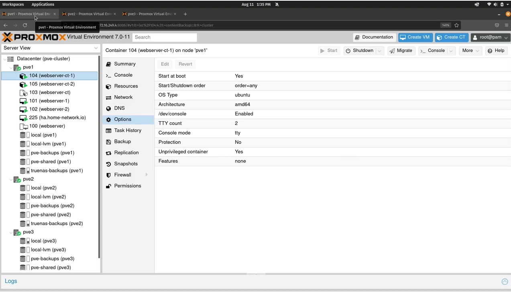
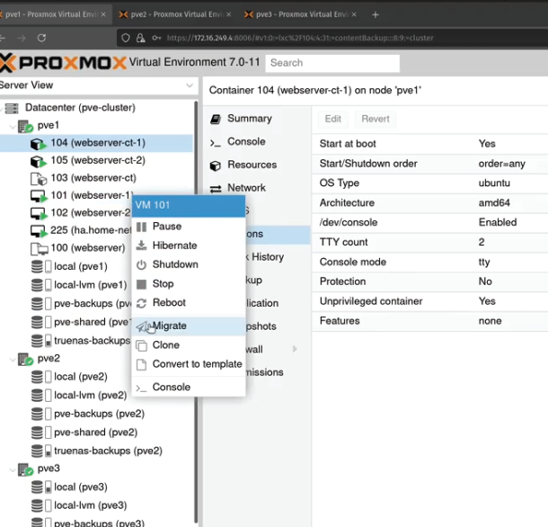

# [Course](https://www.youtube.com/watch?v=LCjuiIswXGs&list=PLT98CRl2KxKHnlbYhtABg6cF50bYa8Ulo)
- also in Drobox vidserv

# Proxmox VE Full Course Class 1 - Getting Started.mp4

# Proxmox VE Full Course Class 2 - Installation Process.mp4
# Proxmox VE Full Course Class 3 - Web Console Overview.mp4
# Proxmox VE Full Course Class 4 - Containers vs Virtual Machines.mp4
# Proxmox VE Full Course Class 5 - Launching a Virtual Machine.mp4
# Proxmox VE Full Course Class 6 - Creating Virtual Machine Templates.mp4
# Proxmox VE Full Course Class 7 - Creating Containers.mp4
# Proxmox VE Full Course Class 8 - Creating Container Templates.mp4
# Proxmox VE Full Course Class 9 - User Management.mp4
# Proxmox VE Full Course Class 10 - Backups and Snapshots.mp4
# Proxmox VE Full Course Class 11 - Integrated Firewall. mp4
# Proxmox VE Full Course Class 12 - The Command-Line Interface.mp4
# Proxmox VE Full Course Class 13 - Networking.mp4
# Proxmox VE Full Course Class 14 - Shared Storage.mp4
# Proxmox VE Full Course Class 15 - Clustering.mp4
# Proxmox VE Full Course Class 16 - High Availability. mp4
- High Availability
- 3 servers in Cluster

- 3 servers required for high availability
- 2 server is the min required to **live migrate** a VM
  - right click a VM, click `migrate` to different host
- High availaibily means if a VM goes down, then another starts in another **node**.  If somethings happens to one of the proxmox servers, your VMs start on another server
- Here he manually migrates VM from PVE1 to PVE2, but did so manually

# Z_Launching a Windows VM in Proxmox.mp4